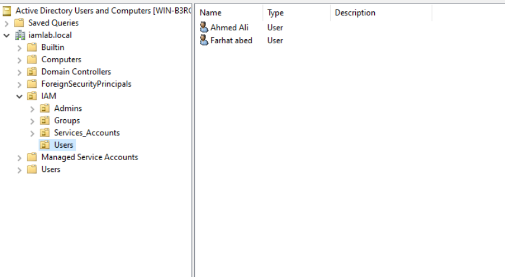
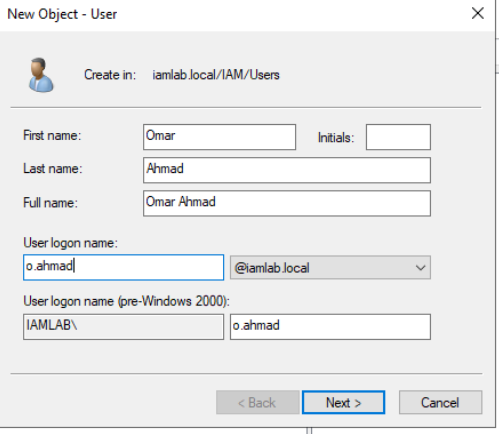
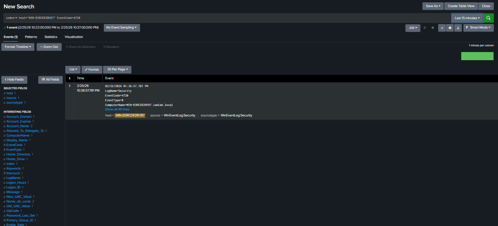
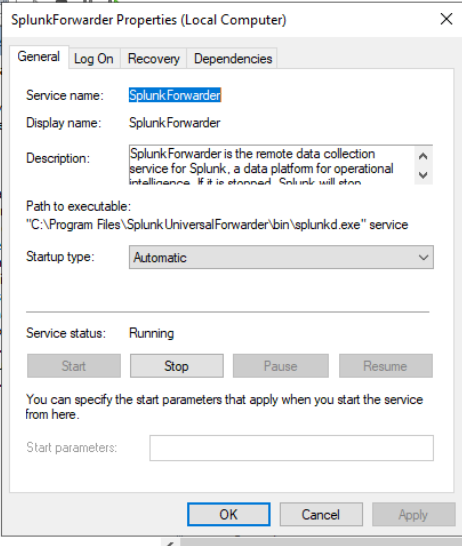
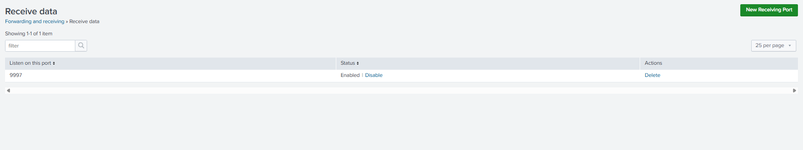

# IAM & Splunk Home Lab

## 🔹 Overview

This project demonstrates a hands-on Identity and Access Management (IAM) lab integrated with Splunk for security monitoring and audit validation.

## 🔹 Lab Components

* Windows Server Domain Controller
* Active Directory (AD DS)
* Splunk Enterprise (Host)
* Splunk Universal Forwarder
* NAT-based VMware Lab

## 🔹 Key IAM Use Cases Implemented

* User lifecycle management (Joiner/Mover/Leaver)
* Security group provisioning
* Privileged access monitoring
* Windows Security Event monitoring
* Audit trail validation in Splunk

## 🔹 Architecture

(Insert diagram here)

## 🔹 Sample Detection Queries

### User Created

```spl
index=wineventlog EventCode=4720
```

### User Added to Group

```spl
index=wineventlog EventCode=4728
```

### Account Lockout

```spl
index=wineventlog EventCode=4740
```

## 🔹 Screenshots

### Active Directory OU Structure



### User Creation (Joiner Scenario)



### Splunk Detection — User Created (Event 4720)



### Splunk Universal Forwarder Service



### Splunk Receiving Port (9997)




## 🔹 Skills Demonstrated

* Identity & Access Management (IAM)
* Active Directory Administration
* Splunk SIEM Integration
* Security Monitoring
* Windows Event Analysis
* Troubleshooting & Root Cause Analysis

## 🔹 Author

Your Name
deaa refaie
